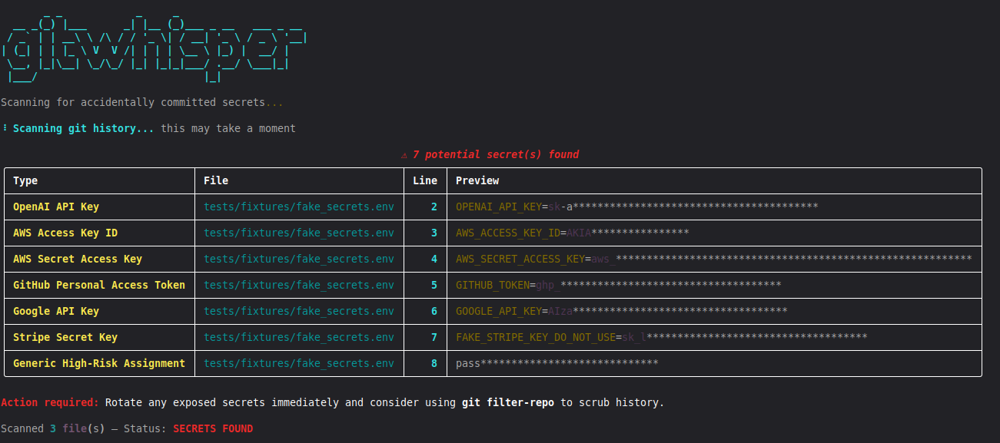

# gitwhisper 🔐


A CLI tool that scans git repositories for accidentally committed secrets — API keys, tokens, and credentials — before they become a problem.

## Demo



## The Problem

People get burned by exposed secrets constantly. Leaked AWS keys have resulted in thousands of dollars in unexpected bills. Exposed OpenAI keys get scraped within minutes. And the worst part? Deleting the file doesn't help — the secret lives on in your git history forever.

gitwhisper catches secrets before they cause damage.

## Features

- 🔍 Scans files for 9+ known secret patterns (OpenAI, AWS, GitHub, Google, Stripe, and more)
- 📜 Scans git commit history with `--history` — because deleting a file doesn't remove it from git
- 🔒 Redacted output — shows you what was found without re-exposing the secret
- ⚡ Live progress indicator
- 🚦 Exit code 1 on findings — drop it straight into CI pipelines
- 🔇 `--no-banner` flag for clean CI output
- 📜 Scans git commit history with `--history` — because deleting a file doesn't remove it from git

## Installation

```bash
git clone https://github.com/mlegan471/gitwhisper.git
cd gitwhisper
pip install -e .
```

## Usage

Scan current directory:
```bash
gitwhisper .
```

Scan a specific path:
```bash
gitwhisper /path/to/repo
```

Also scan git commit history:
```bash
gitwhisper . --history
```

Use in CI (no banner, exit code 1 on findings):
```bash
gitwhisper . --no-banner
```

## Supported Secret Types

| Type | Example Format |
|------|---------------|
| OpenAI API Key | `sk-...` |
| AWS Access Key ID | `AKIA...` |
| AWS Secret Access Key | `aws_secret_access_key = ...` |
| GitHub Personal Access Token | `ghp_...` |
| GitHub OAuth Token | `gho_...` |
| Google API Key | `AIza...` |
| Stripe Secret Key | `sk_live_...` |
| Slack Bot Token | `xoxb-...` |
| Private Key Block | `-----BEGIN ... PRIVATE KEY-----` |
| Generic High-Risk Assignment | `password = "..."` |

## Running Tests

```bash
python -m pytest tests/ -v
```

## Why I Built This

Secrets leaking into public repositories is one of the most common and costly security mistakes in software development.

GitHub already has secret scanning built in — so why build this? Because GitHub's scanning is reactive. By the time it alerts you, the secret has already hit the network and may have been scraped by bots that watch GitHub in real time. gitwhisper is proactive. You run it before you push, or wire it into your CI pipeline so secrets never leave your machine.

There's also a broader case for a tool like this:
- Works on any git repo regardless of host (GitHub, GitLab, Bitbucket, self-hosted)
- Can be installed as a pre-commit hook to catch secrets at the earliest point in the developer workflow
- Enterprise teams that can't use cloud-based scanning for compliance reasons can run this locally

I built gitwhisper to understand the detection problem from the inside — how pattern matching works, where the edge cases are, and what it takes to reduce false positives without missing real findings.

## License

MIT
